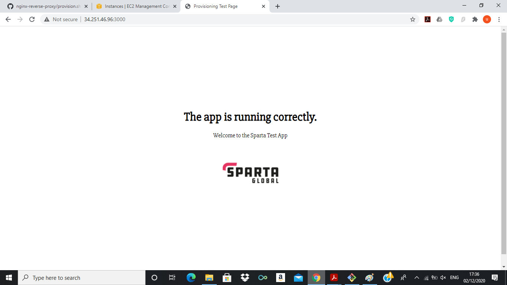

# aws-docs
### What is the cloud
- The cloud refers to computer services (eg data storage, software, prcessing power etc) that can be accessed remotely over the internet. Cloud services are stored on internet services as opposed to the user's hard drive.

### What is AWS
- AWS is a cloud computing platform that provides various computing services to customers. It's run by Amazon and approximately 40% of the internet runs on AWS

### What is EC2
- Elastic Cloud Computing is a service provided by AWS which allows users to rent virtual computers on which to run their own applications

### What is a security group
- When you launch an instance on AWS you can specify one or more security groups, and these serve as virtual firewalls for the instance to control incoming and outgoing traffic by specifying user permissions

### How do you open a port to your IP? and to the world?
- When configuring security groups during the creation of an instance, select the "My IP" option for Source. To open the port to the world, select the "Anywhere" option

### Where do you keep your ssh keys
- Away from code, in /User/.ssh

### How to ssh into a remote server
```ssh -i ~/.ssh/privatekey user@publicip```

### How to send one file to remote server
```scp -i path/privatekey path/file user@publicip:path/destination```

### How to send multiple files
```scp -i path/privatekey -r path/folder user@publicip:path/destination```

### App running on port 3000


### App running on port 80

